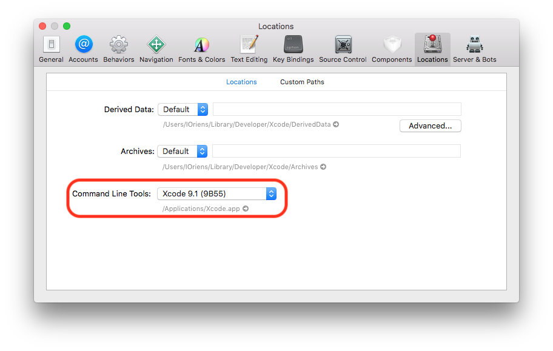

## 前端依赖

需要在系统中安装 Node.js 环境, 使用以下方法确认系统中 Node 的版本：

```sh
node -v
```

如果得到的版本低于`v7.6.0`，或是提示找不到 `node` 命令，请[点此](https://nodejs.org/en/)下载最新的 Node 环境安装包

> Tips: 如果下载时出现网络问题，可以尝试使用 [nrm](https://github.com/Pana/nrm) 或 [npm config](http://cnodejs.org/topic/4f9904f9407edba21468f31e) 命令切换至[国内的 npm 源](http://www.jianshu.com/p/171ec231ced4)

## iOS

首先需要在系统中安装 `Xcode 8.0` 或更高版本。你可以通过App Store或是到[Apple开发者官网](https://developer.apple.com/xcode/downloads/)上下载。这一步骤会同时安装Xcode IDE和Xcode的命令行工具。

安装完成后启动`Xcode`，并在`Xcode | Preferences | Locations`菜单中检查一下是否装有某个版本的`Command Line Tools`。



最后使用如下命令安装依赖管理工具 [cocoapods](https://cocoapods.org/)

```sh
sudo gem install cocoapods
```

## 安装运行

安装本项目

```sh
npm i hera-cli -g
```

初始化小程序

```sh
hera init projName
```

进入新建的项目, 确认根目录有 `config.json` 文件：

```sh
# 进入项目
cd projName

# 查看配置文件
cat config.json
```

运行

```sh
hera run ios
```
<br />
<p>注意：以上步骤只适用于虚拟机环境，如果想运行在真机，请阅读：<a style="color:#3898FC" href="#/ios/ios-real-device">真机调试</a></p>
